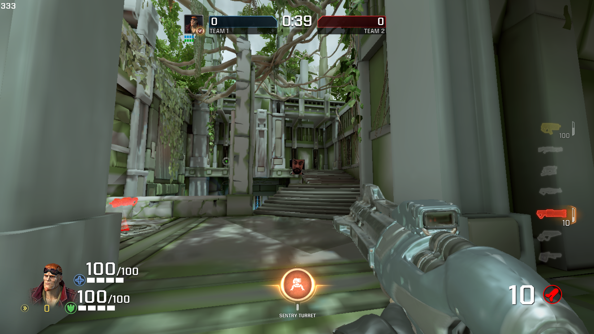
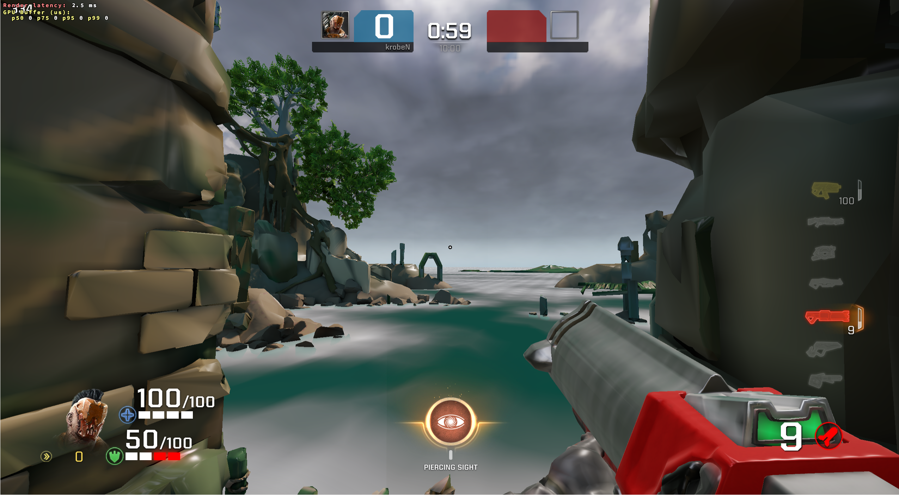

# krosshair
A crosshair overlay for games on linux using vulkan.

## Installation
`
make && make install
`

## Usage
Simply start the your game with `KROSSHAIR=1` set. When using steam, put `KROSSHAIR=1 %command%` into the launch options of your game. Additionally you can use the following variables to customize your crosshair.
- `KROSSHAIR_IMG=/path/to/crosshair-image.png` (i've provided some crosshairs in [here](https://github.com/krob64/krosshair/tree/main/crosshairs), copy them wherever you like)
    - alternatively you can use a [crosshair generator site](https://crosshair.themeta.gg/) (or [this one](https://guywiddacaptain.github.io/aimX/))
- `KROSSHAIR_SCALE=1.0` (scaling the scrosshair may make it look blurry, i'd suggest to just create a bigger/smaller crosshair)

## Can i get banned for this?
I don't know, use at your own risk. I've only used it in Quake Champions and STRAFTAT, both of which don't really have an anticheat.

## Issues
As of now, the overlay leaks a bit of memory everytime you alt-tab out of/into the game, as well as everytime the window is being resized and upon resolution changes. It's not a big leak and shouldn't cause any problems, but it's still worth noting.
I've tried fixing it multiple times but have always hit a dead-end. If someone more experienced with vulkan wants to help, take a look at [this issue](https://github.com/krob64/krosshair/issues/1). I know it's a bit of a mess, this whole project is based on a morally questionable apex legends project which i'm unsure if i should link to it here, coupled with me jumping into it right after completing the vulkan tutorial.
